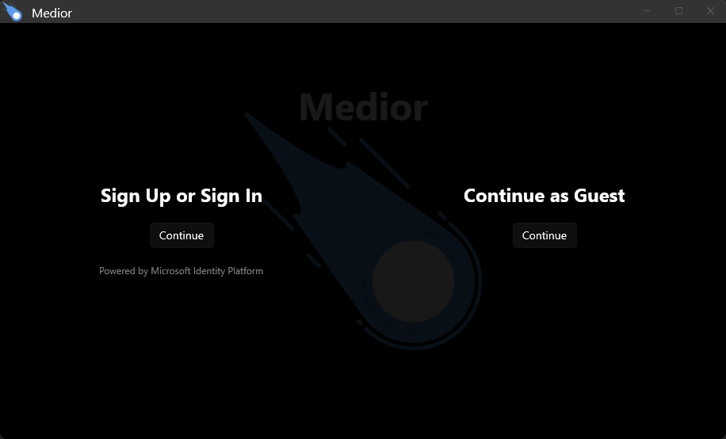
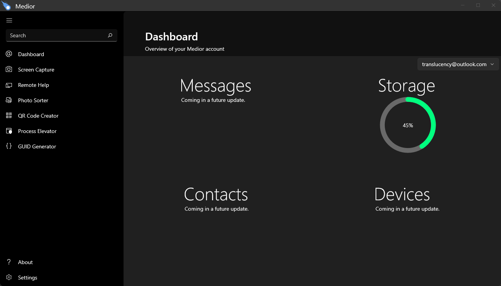
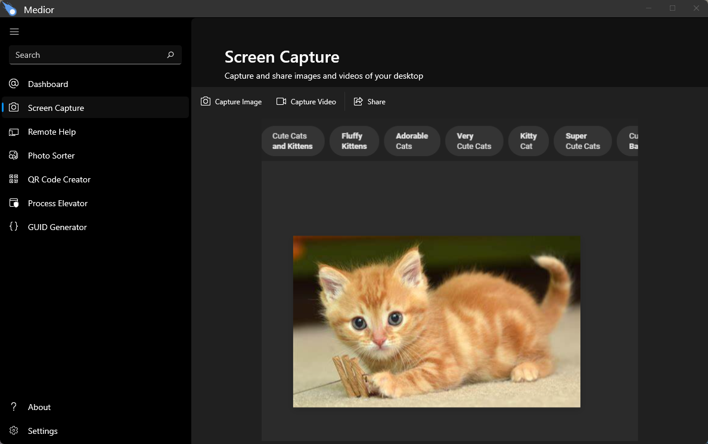
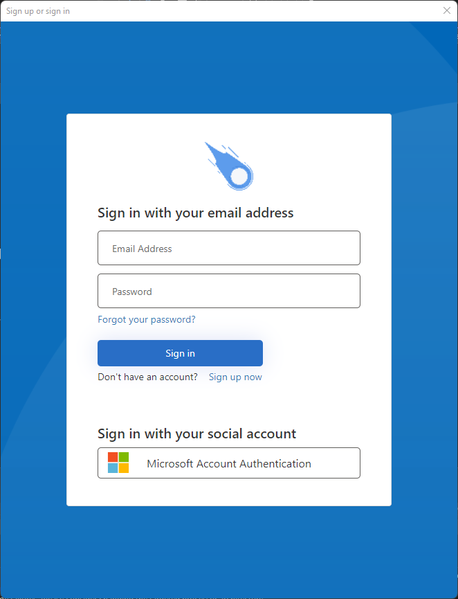

# Medior
A productivity and multimedia toolkit for Windows.  Powered by .NET 6, WinUI 3, Azure AD B2C, and CosmosDB.

> Notice: Project has been archived.

Currently in development, Medior is a Windows-only productivity app that will release on the Windows Store.  Authentication is powered by Azure AD B2C, and data is stored in Azure CosmosDB.  The back-end is built with ASP.NET Core Web API and SignalR.

The initial feature-set will include remote control (attended and unattended), remote process and script execution, desktop capture, file and image sharing, chat, contacts (both users and devices), and various productivity tools.  Eventually, there will be an Android companion app.

It's intended for technical-oriented home users who often need to assist family and friends on their devices.

I'm basically building this for myself.

But you're welcome to join.  :)

